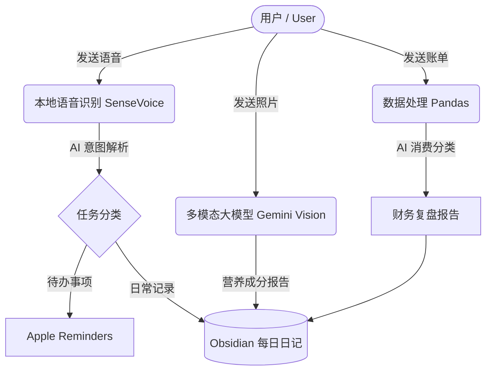

# 🌟 Life Manager | 全能个人生活管家

<div align="center">

[](https://www.python.org/)
[](https://deepmind.google/technologies/gemini/)
[](https://obsidian.md/)
[]()

[**中文**](#-中文说明) | [**English**](#-english-documentation)

*An intelligent life management system powered by Local ASR and LLM.*  
*基于本地语音识别与大语言模型构建的智能个人生活管理中心。*

</div>

---

## 🇨🇳 中文说明

**Life Manager** 是一个自动化、智能化的生活管理工具。它能将你的日常碎片信息（语音、图片、账单）通过 AI 自动分类、解析，并无缝同步到 **Obsidian** 个人知识库和 **Apple Reminders**。

完全解放双手，让你的生活记录井井有条。

### ✨ 核心功能

*   🎙️ **语音闪记 (Voice to Tasks)**
    *   使用本地大模型 (`SenseVoiceSmall`) 进行极速语音转文字，隐私安全。
    *   自动识别语音意图，智能分类为“待办”、“日志”或“对话”。
    *   自动提取待办事项并同步至 macOS 的 **Apple Reminders**。
*   🥗 **饮食追踪 (Food Nutrition Analysis)**
    *   拍照即可记录饮食。
    *   利用多模态大模型 (`Gemini Vision`) 自动识别菜品，估算卡路里与三大营养素。
*   💰 **自动财务复盘 (Automated Financial Reports)**
    *   支持微信支付 / 支付宝导出的 CSV 或 Excel 账单。
    *   AI 自动进行消费分类，生成高颜值的月度财务复盘 Markdown 报告。
*   📓 **Obsidian 无缝对接 (Obsidian Sync)**
    *   所有日志、财务报告和图片附件自动整理并归档至 Obsidian 的每日日记 (Daily Notes) 中。

### ⚙️ 工作流架构 (Workflow)




---

## 🇬🇧 English Documentation

**Life Manager** is an automated and intelligent life management hub. It processes your daily fragmented inputs (voice memos, food photos, financial statements) using AI, then seamlessly syncs them to your **Obsidian** vault and **Apple Reminders**.

### ✨ Features

*   🎙️ **Voice to Tasks:** Transcribes voice messages using local `SenseVoiceSmall` for privacy. Analyzes intent (Tasks vs. Logs) and automatically adds items to **Apple Reminders**.
*   🥗 **Nutrition Analysis:** Snap a photo of your meal. Uses `Gemini Vision` to estimate calories and macros (Protein, Carbs, Fats).
*   💰 **Financial Reports:** Parses WeChat/Alipay CSV exports. The LLM categorizes your spending and generates a beautiful Monthly Financial Review.
*   📓 **Obsidian Sync:** Everything (daily logs, categorized tasks, financial reports, and images) is automatically formatted and appended to your Obsidian Daily Notes.

### 🚀 Getting Started (快速开始)

#### Prerequisites (环境要求)
*   macOS (for Apple Reminders integration)
*   Python 3.10+
*   [Obsidian](https://obsidian.md/)
*   `remindctl` installed via Homebrew (`brew install remindctl`)
*   Gemini API Key

#### Installation (安装)

```bash
# Clone the repository (克隆代码库)
git clone https://github.com/YourUsername/life-manager.git
cd life-manager

# Setup virtual environment (配置虚拟环境)
python3 -m venv venv
source venv/bin/activate

# Install dependencies (安装依赖项)
pip install funasr pandas google-generativeai pillow
```

#### Configuration (配置)

Export your Gemini API Key and (optionally) your Obsidian Vault path:

```bash
export GEMINI_API_KEY="your_api_key_here"
export OBSIDIAN_VAULT_PATH="~/Library/Mobile Documents/iCloud~md~obsidian/Documents"
```

---
